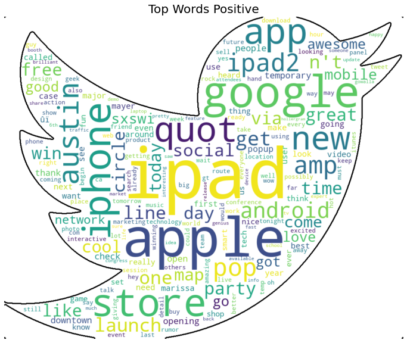
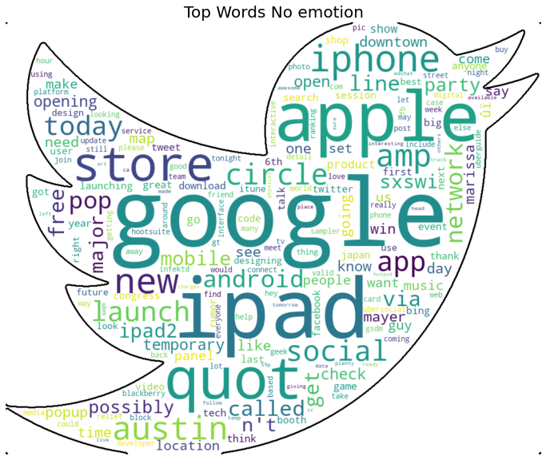

# Twitter Sentiment Analysis on Apple & Google Products

## Is a tweet Positive, Negative or Neutral?

## By: Hiten Patel 

In one day, there are over 500 million tweets among all twitter users. That's 6,000 tweets every second. You can assume they are either positive, negative or neutral. They could be about a person, place, or thing. In this case, it will be about products. Apple has over 13 million twitter followers and Google has over 22 million twitter followers. The goal of this project is to build a Natural Processing Language model to analyze twitter sentiments about Apple and Google products as either positive, negative or neutral. The dataset comes from CrowdFlower via data.world and it contains over 9,000 tweets that include all words that are related to the Apple or Google brand. 

Questions we will be looking to answer are; 
* What is the best way to preprocess the data? Word_tokenizer or Tweet_tokenizer? Both methods are useful, effective and each have there advantages. 
* What type of vectorizer should we use? Count vectorizer or tfidf vectorizer?
* What is the best model to use? Support Vector Machines, Random Forest Classifier or MultinomialNB?
* How can the companies use consumer feelings/opinions about a product or service to their business advantage?


## Dataset

The dataset comes from Crowdflower on the website data.world. The data contains over 9000 tweets. Over 63% of the data contains neutral tweets, 30% of the data is positive tweets and less than 7% is negative tweets. 

Here is the link for the data. 
https://data.world/crowdflower/brands-and-product-emotions/workspace/file?filename=judge-1377884607_tweet_product_company.csv

## The Process


The dataset contained over 9,000 tweets and after the initial observations and clean up, we performed additional pre-processing methods for the Natural Language Process (NLP), which were the following:  

* All words are lowercased
* Common words and special characters are removed
* URL links are removed
* Words are tokenized


The diagram above is a general idea of the NLP pre-process. We used two different methods to create our tokens; word_tokenize() and nltk tweettokenizer(). Each method has the same concept but different execution. Word_tokenize() does a better job pre-processing urls and tweettokenizer() does a better job of preprocessing handles(@twitter_handle). After running the FreqDist() method we noticed both tokenizers yielded some common terms with high amount of frequency. We removed the following words:
* "sxsw" which stands for south by southwest
* "mention"
* "rt" which stand for retweet
* "link" 

The words below are the most frequent words contained in the dataset using each tokenizer. The larger the word appears the more frequent it occured. 


### TF-IDF Vectorization

Term frequency–inverse document frequency (tf-idf), is the vectorization method we chose. It's a numerical statistic that is intended to reflect how important a word is to a document in a collection. 


## Support Vector Machines

Support Vector Machines classifier was the chosen model as it outperformed Random Forest Classifier and MultinomialNB. After performing the gridsearch method, the hyper parameters were adjusted to;  

> 
>* kernel = 'linear'
* class_weight = 'balanced'
* gamma = 'scale'

SVM  had an average accuracy score of .92 for the training data and an average accuracy score of .68 for the test data. 


Below are the most common words for positive tweets, no emotion tweets, and negative tweets. There are common words in each category which made it difficult for the model to predict. Although the training data tested at 92%, there is a significant drop off at 68% on the testing data. 





Below is an example of how the model is predicting one tweet and how the words are weighted for each classifier. 


## Recommendation

The Support Vector Machines model returned an accuracy rate of 68%. Any method of vectorization (count/tfidf) combined with any method of tokenizer (word_tokenizer/tweet tokenizer) would yield the same results. According to the visuals produced, positive tweets, negative tweets and neutral tweets all have similar terms with high frequency. After reviewing the data, we have the following recommendations; 
* Both Google and Apple should have a strong presence at the yearly South by Southwest music and media festivals 
* Promotional offers to users who send out positive tweets
* Monitor and respond negative tweets live 

## Future Work

The next steps to improve the model would be; 
* Larger balanced dataset
* Additional preprocessing: removing misspelled words
* Perform deep NLP: Word embeddings 


```python

```
